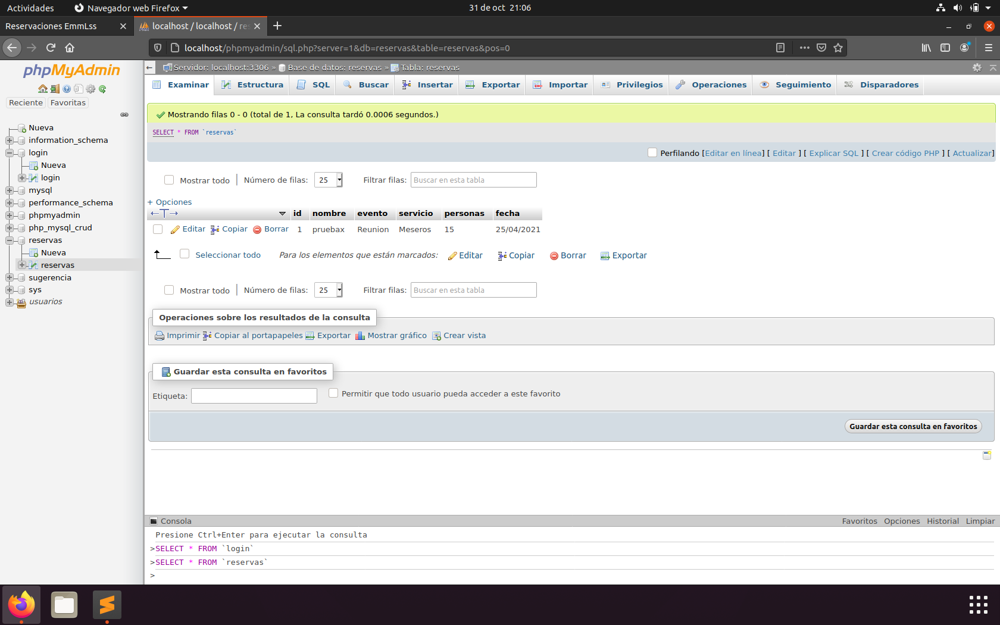
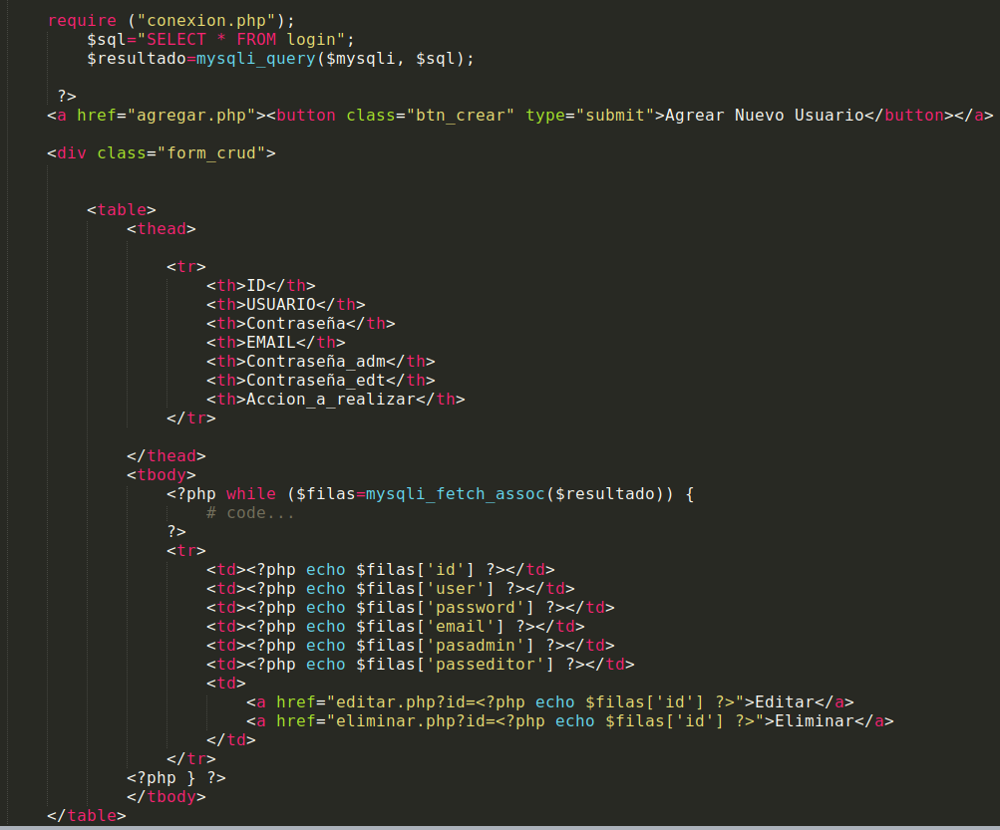

# T4-03 Avances del proyecto
### EmmLss Reservations.
#### Aquí se muestra la primer base de datos llamada Login, cuenta con una sola tabla que tiene el mismo nombre.

###### Esta sintaxis ocupamos para conectarnos a la primer base de datos "Login".

#### Esta es nuestra segunda base de datos llamada Reservas que igual solo contiene una sola tabla con el mismo nombre.

###### Para establecer conexión con esta base de datos desde nuestro proyecto ocupamos la siguiente sintaxis.

#### A continuación se muestran los avances que se llevan de proyecto de reservaciones, ya incorporando tipos de usuario y CRUD en base de datos.
#### Se muestra el primer vistazo de lo que va ser el formulario de login.

#### El "cuerpo" o contenido de esté formulario se encuentra en es este código.
###### Código

#### Este es el formulario para el registro de un nuevo usuario.

###### El contenido de este formulario se encuentra en esta parte del código.

###### Lo que nos conecta entre un formulario y otro (login y registrarse) es una etiqueta "href".

#### Cuando el cree su cuenta e inicie sesión, esté accederá a la página y tendrá esta vista como inicio (Falta ajustar el tamaño de la pantalla).

#### El usuario ya puede realizar reservas, sus datos de usuario como de la reserva se verá reflejado en la base de datos.

#### También se ha agregado una cuenta de Administrador, cuando este inicie sesión verá la siguiente ventana.

###### Este es el código que hace funcionar la ventana de administrador al igual que la tabla de usuarios conectada con su respectiva base de datos.

#### En esta ventana el usuario Administrador puede realizar un CRUD a los usuarios.
###### Esta sintaxis ocupa para agregar uno nuevo.

###### Con esta puede editar los campos del registro seleccionado.

###### Y este es para eliminar de la base de datos un registro.

#### Cuando un usuario de clic en botón de "salir" automáticamente se cierra su sesión, y lo que hace esto posible es lo siguiente.

